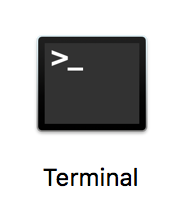

# First Day Accounts

Items to be handled on first day orientation.

Open a Terminal app.
Ooh, ooh, Do this ->

Find the `shell` or `terminal` or `term` (all names for the command interpreter).

`terminal` or `shell` mean pretty much the same thing - `/Applications/Utilities/Terminal.app` and start it up.

It looks like this -> 

Type `whoami` and `enter` or `return`. Congratulations, you just typed a command. You're Welcome.

now, type `git --version` and make note of what comes back, the version number of git.

## Downloads

* BlueJ http://bluej.org
* Atom http://atom.io
* JDK for Java 8 (if it isn't there already)
* Brew http://brew.sh
* make sure git is installed (see above)
* Slack app download, signin 

## Accounts to be created

_Be sure to use professional names when signing up. (`BlueHenCoder` is okay, `SuperHunkyBeachBoy` is much less so, eh?)_

* Email: gmail gmail gmail gmail gmail
* Slack
* Github
 * BE SURE to add a avatar pic to github account.
 * Register for account on GitHub (https://github.com/). We recommend using a username that incorporates your name (jfiksel, mtaub, lrjager)
 * `$ git --version` and `$ git config` in the terminal to configure your shell for your new git account.
 * go to https://Git.Zipcode.Rocks then use your github username/id to register account on https://git.zipcode.rocks (the private ZCW Git server)
 * Fill out this [form](https://goo.gl/forms/sEHRc2F2u3E1sWh42) with your Github username
* Pluralsight videos

